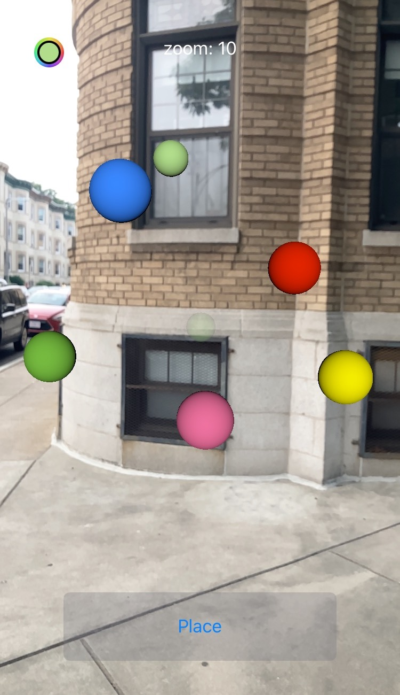
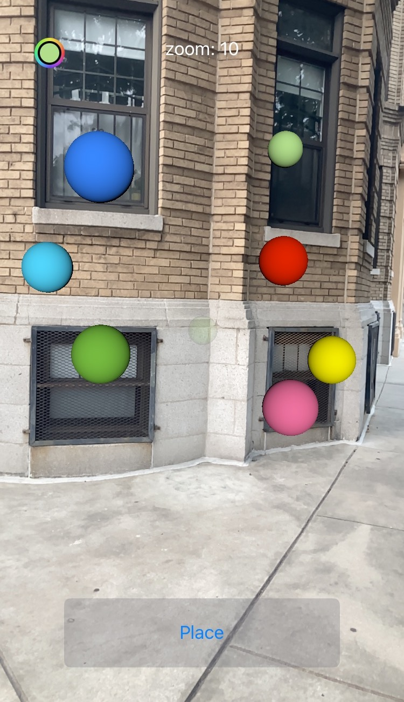

# Draw_in_3D

Draw in Augmented Reality with this amazing app!

||||
|---|---|---|

### Installation

Require [Xcode](https://developer.apple.com/xcode/)

- Copy the files in your computer
- Open Draw in 3D in Xcode
- Select your iphone as the target build device
- Build and run the app

### Usage

- Pinch to change size of objects
- Color wheel to select color of objects
- `Place` Places the reference object in the scene
